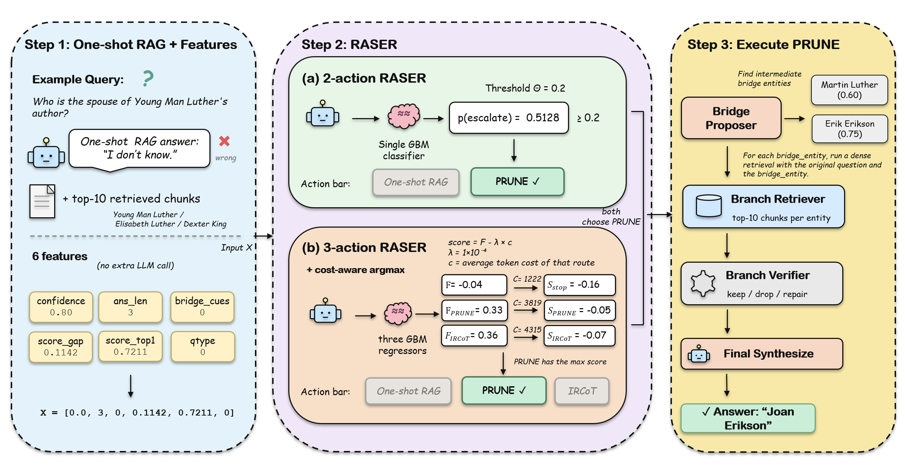
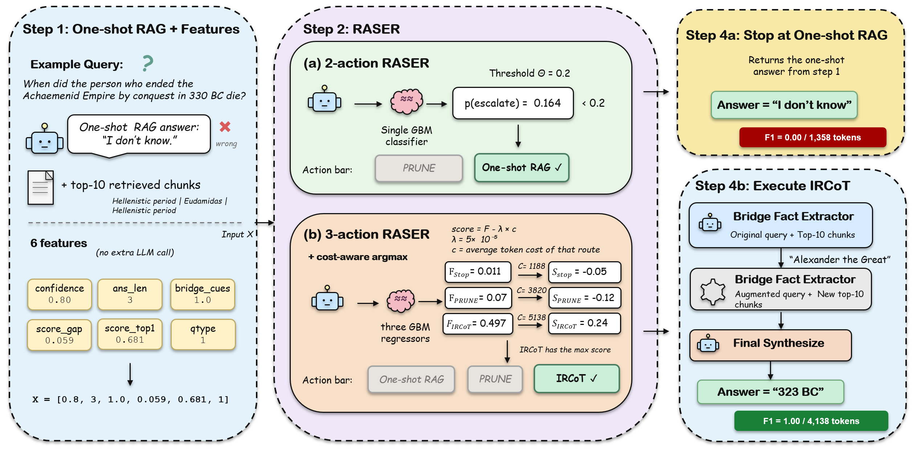

# RASER — Recoverability-Aware Selective Escalation Router

Reproducibility code for *RASER: Recoverability-Aware Selective Escalation
Router for Multi-Hop Question Answering* (EMNLP 2026 submission).

RASER is a small, cheap router that runs after one-shot RAG and decides
whether to escalate to a more expensive retrieval action. The router
uses six features computed from the first-pass retrieval; no extra LLM
call is needed for the routing decision itself.

The paper proposes two variants:

| Variant | Head | Decision rule | Routes |
|---|---|---|---|
| **RASER-2** | 1 binary GBM classifier | `p(escalate) ≥ θ` | one-shot RAG, PRUNE |
| **RASER-3** | 3 GBM regressors (one per route) | cost-aware argmax `f_r − λ·c_r` | one-shot RAG, PRUNE, IRCoT* |

Everything else (features, retriever, reader LLM, 5-fold CV protocol)
is shared.

**For the numbers**: see [RESULTS.md](RESULTS.md) for paper Tables 2, 5, 6,
and 12 rendered directly from the JSON summaries in this repo.

---

## How RASER works (paper §4)

### RASER-2: two-route classifier

A 2-action RASER chooses between two actions: the cheap **one-shot RAG**
and the expensive **PRUNE** bridge step. PRUNE tries to find the
*bridge entity* — the missing intermediate fact that links the
question's two hops. For example, to answer *"Who is the spouse of
Young Man Luther's author?"* the router has to identify the bridge
entity (Erik Erikson, the author of the book), then look up his spouse.

PRUNE itself has four steps: ask the LLM to propose up to two
candidate bridge entities, re-retrieve using each, drop weak entities
with a lightweight verifier, and ask the reader for a final answer.

RASER-2 itself has four steps:
1. Run one-shot RAG to get a draft answer and top-$k$ chunks.
2. Compute six features from the retrieved scores, the draft answer,
   and the question text (no extra LLM call).
3. A GBM (Gradient Boosting Machine) classifier estimates
   $p(\text{BRIDGEABLE}\mid \mathbf{x})$ — the probability that PRUNE
   will improve the draft answer.
4. If $p \ge \theta$ (deployed: $\theta = 0.20$), run PRUNE and
   return its answer; otherwise return the one-shot draft.



*Figure: full pipeline on a question that PRUNE solves. One-shot RAG
returns "I don't know"; the features (small score gap, IDK answer,
entity question) put $p(\textsc{BRIDGEABLE}) = 0.5128 > 0.20$, so
RASER-2 runs PRUNE; the Bridge Proposer extracts Erik Erikson; the
Final Synthesizer returns Joan Erikson.*

### RASER-3: three-route cost-aware router

A yes/no classifier can not say *"Route B is better than A, but route
C is even better."* So with three routes (one-shot RAG, PRUNE,
IRCoT*), we replace the classifier with **three score regressors**.
Each regressor looks at the same six features and predicts the F1 a
specific route would get on this question:
$\hat{f}_\text{STOP}(\mathbf{x})$,
$\hat{f}_\text{PRUNE}(\mathbf{x})$,
$\hat{f}_\text{IRCoT*}(\mathbf{x})$.

Pick the route that maximises predicted F1 minus a cost penalty:

$$ r^{*} = \arg\max_{r}\; \big[\,\hat{f}_r(\mathbf{x}) \;-\; \lambda \cdot \bar{c}_r\,\big] $$

where $\bar{c}_r$ is the average token cost of route $r$ on training
data and $\lambda$ controls how aggressively the router spends. At
$\lambda = 0$ the router takes the highest predicted F1 regardless of
cost; at large $\lambda$ it always stops. The deployed $\lambda$ per
(LLM, dataset) cell is derived from the **cost-budget rule**: pick the
largest $\lambda$ such that training-fold average spend stays $\le
0.60 \times$ always-IRCoT*'s tokens.



*Figure: a case where RASER-2 and RASER-3 disagree. RASER-2's
$p(\textsc{BRIDGEABLE}) = 0.164 < 0.20$, so it stays with the one-shot
"I don't know" (F1 $= 0$). RASER-3 predicts $\hat{f}_\text{IRCoT*} =
0.50$, much higher than the other two; after the cost penalty IRCoT*
still wins; two retrieve-extract rounds find "323 BC" (F1 $= 1$).*

### Using the trained routers

Per-cell trained checkpoints are in `checkpoints/<LLM>/<dataset>/`.
Each cell has:
- `raser2_classifier.pkl` (binary GBM)
- `raser3_stop.pkl`, `raser3_prune.pkl`, `raser3_iter.pkl` (3 regressors)
- `metadata.json` (feature names, $\theta$, deployed $\lambda$,
  training-fold route costs, etc.)

Loading and running RASER-2:

```python
import pickle, json
import numpy as np

cell = "checkpoints/Llama-3_1-8B/MuSiQue"
clf = pickle.load(open(f"{cell}/raser2_classifier.pkl", "rb"))
meta = json.load(open(f"{cell}/metadata.json"))
theta = meta["raser2"]["threshold_theta"]      # 0.20

# Six features in order:
# [confidence, ans_len, bridge_cues, score_gap, score_top1, qtype]
x = np.array([[0.8, 3, 1.0, 0.059, 0.681, 1]])  # Achaemenid example
p = clf.predict_proba(x)[0, 1]
action = "PRUNE" if p >= theta else "ONE-SHOT RAG"
```

Loading and running RASER-3:

```python
import pickle, json
import numpy as np

cell = "checkpoints/Llama-3_1-8B/MuSiQue"
meta = json.load(open(f"{cell}/metadata.json"))
lam = meta["raser3"]["deployed_lambda"]            # 5e-05 on this cell
c   = meta["raser3"]["training_route_costs"]       # {STOP: ~1188, PRUNE: ~3820, ITER: ~5130}

regs = {r: pickle.load(open(f"{cell}/raser3_{r.lower()}.pkl", "rb"))
        for r in ["stop", "prune", "iter"]}
f   = {r: regs[r].predict(x)[0] for r in regs}
score = {r: f[r] - lam * c[{"stop":"STOP","prune":"PRUNE","iter":"ITER"}[r]] for r in regs}
action = max(score, key=score.get)   # one of {stop, prune, iter}
```

The 18 cells cover (LLM, dataset) for the six LLMs and three datasets
reported in the paper. To retrain on a new cell, run
`src/eval/train_deployment_routers.py` after producing the baseline
trace files (Step 1 below); see also `checkpoints/INDEX.json` for the
full list.

---

## 1. Setup

```bash
# Python 3.10+ recommended
python -m venv .venv
source .venv/bin/activate
pip install -r requirements.txt

# Optional: spacy NER for the ChainRAG baseline
python -m spacy download en_core_web_sm
```

### Environment variables

Set these before running anything that calls an LLM:

```bash
export LLM_API_KEY="your_api_key"
export LLM_BASE_URL="https://your-llm-endpoint/v1"
```

The code falls back to no key if the variable is unset, which fails at
runtime. **Never commit your API key.**

---

## 2. Code map: RASER-2 vs RASER-3

Both variants share **all** of the inputs (six features, one-shot RAG,
training labels) and **all** of the bridge-execution code (the PRUNE
pipeline). They differ only in the router head and the decision rule.

### 2.1 Shared (used by both R2 and R3)

| File | What it does |
|---|---|
| `src/eval/answer_normalizer.py` | F1 metric; rule-based question-type classifier (entity/date/yes-no/count/other) |
| `src/eval/three_route_canonical.py` | Feature extraction (`_features`); 5-fold CV protocol; trace loading; main reporting table |
| `src/eval/three_route_feasibility.py` | Per-(LLM, dataset) trace file paths |
| `src/eval/baselines.py` | Runners for STOP, PRUNE, IRCoT, Self-Ask (produces trace files) |
| `src/tools/text_tools.py` | TextRetriever (BM25 + dense / nomic) |
| `src/tools/llm_utils.py` | `call_chat` (OpenAI-compatible API wrapper) |
| `src/tools/encoders.py` | Nomic / Qwen embedding wrappers |
| `src/methods/abv_bridge/` | The full PRUNE execution pipeline: Bridge Proposer → Branch Retriever → Branch Verifier → Final Synthesizer. **R2 and R3 both invoke this when they pick PRUNE.** |

### 2.2 RASER-2 specific

| Component | Where |
|---|---|
| Binary GBM classifier head | `eval_r2_cell()` in `src/eval/three_route_canonical.py` |
| Deployed threshold θ = 0.20 | constant `THETA` in `three_route_canonical.py` |
| Training label: `y = 1 iff F1(PRUNE) > F1(STOP) + τ` (τ = 0.1) | `eval_r2_cell()` |
| R2 classifier ablation (LogReg, MLP, XGBoost, LightGBM, CatBoost) | `src/eval/router_model_ablation.py` (`clf_models()`, `eval_r2_cell()`) |
| R2 threshold sensitivity (θ ∈ {0.10, ..., 0.30}) | `src/eval/sensitivity_sweep.py` (`THETA_SWEEP`, `eval_r2_cell()`) |
| Deployed online router (called per question at inference) | `src/methods/abv_bridge/router.py` |

### 2.3 RASER-3 specific

| Component | Where |
|---|---|
| Three GBM regressors (one per route) | `eval_r3_cell()` in `src/eval/three_route_canonical.py` |
| Cost-aware argmax `r* = argmax_r [f_r − λ·c_r]` | `_route_choice()` in `three_route_canonical.py` |
| Cost-budget rule (deployed `λ` chosen so train spend ≤ 0.60 × always-IRCoT tokens) | `_pick_lambda()` + `COST_BUDGET_FRAC = 0.60` in `three_route_canonical.py` |
| λ sweep range searched (10 values from 1e-7 to 5e-3) | `LAMBDA_SWEEP` in `three_route_canonical.py` |
| Training labels: per-route F1 directly (`Y[r] = F1[r]`) | `eval_r3_cell()` |
| R3 regressor ablation (Ridge, MLP, XGBoost, LightGBM, CatBoost) | `src/eval/router_model_ablation.py` (`reg_models()`, `eval_r3_cell()`) |
| R3 cost-budget sensitivity (fraction ∈ {0.33, ..., 1.00}) | `src/eval/sensitivity_sweep.py` (`COST_FRAC_SWEEP`, `eval_r3_cell()`) |

### 2.4 Baselines used in the main results table (not part of RASER)

| Baseline | File | Paper name |
|---|---|---|
| Naive RAG (one-shot dense retrieval + LLM) | `src/eval/baselines.py` (`NaiveRAG`) | STOP |
| Bridge-conditioned PRUNE | `src/methods/abv_bridge/` | PRUNE (also the expensive route used by RASER) |
| Iterative retrieval | `src/methods/kirag.py` | IRCoT* (also the IRCoT route used by RASER-3) |
| Sub-question decomposition | `src/methods/chain_rag.py` | Self-Ask* |
| Sentence-graph ChainRAG | `src/methods/chain_rag_faithful.py` | ChainRAG (controlled reimplementation) |

---

## 3. Reproducing the paper

Each paper table has a specific entry-point script. **Run them in order:**
trace files first (Step 1), then RASER evaluation (Steps 2–4).

### Step 1 — generate trace files (one-time, per (LLM, dataset) cell)

Run each baseline once per cell to produce JSONL trace files that the
RASER eval scripts read. Example for one cell:

```bash
# STOP / one-shot RAG (used by both R2 and R3 as the cheap route)
python -m src.eval.baselines \
  --baseline naive_bm25 \
  --data-dir data/processed/musique \
  --n 300 \
  --llm-model llama-3.1-8b \
  --output-dir outputs/sweep_llama31/musique \
  --retriever-mode dense

# PRUNE (used by both R2 and R3 as the bridge route)
python -m src.eval.baselines --baseline abv_bridge ...

# IRCoT* (used only by R3 as the iterative route)
python -m src.eval.baselines --baseline kirag ...

# Self-Ask* (baseline only, not used by R2 or R3)
python -m src.eval.baselines --baseline chain_rag ...

# ChainRAG (baseline only)
sbatch scripts/sbatch_chainrag_faithful.sh
```

Repeat for every (LLM × dataset) cell you want to evaluate. The
expected trace file paths per cell are listed in
`src/eval/three_route_feasibility.py`.

### Step 2 — canonical evaluation (paper Table 2 — main results)

After all trace files exist:

```bash
python -m src.eval.three_route_canonical
```

This script:
- Reads STOP / PRUNE / IRCoT trace files per (LLM, dataset) cell.
- For **RASER-2**: 5-fold CV, fits the GBM classifier, applies threshold
  θ = 0.20, reports routed F1 and tokens.
- For **RASER-3**: 5-fold CV, fits three GBM regressors, picks λ via
  the cost-budget rule on training folds (60% of always-IRCoT tokens),
  applies the cost-aware argmax, reports routed F1 and tokens.

### Step 3 — classifier head ablation (paper Table 12 — Appendix C)

```bash
sbatch scripts/sbatch_router_model_ablation.sh
# or directly:
python -m src.eval.router_model_ablation
```

Re-fits **both** routers with six model families and prints two tables:
- **RASER-2** (binary head): sklearn GBM, LogReg, MLP-32, XGBoost, LightGBM, CatBoost
- **RASER-3** (regression head): sklearn GBM, Ridge, MLP-32, XGBoost, LightGBM, CatBoost

Total CPU time ≈ 2 minutes on 8 cores.

### Step 4 — threshold + cost-budget sensitivity (paper Tables 5/6 — Appendix D)

```bash
sbatch scripts/sbatch_sensitivity_sweep.sh
# or directly:
python -m src.eval.sensitivity_sweep
```

Sweeps two hyperparameters independently:
- **RASER-2**: threshold θ ∈ {0.10, 0.15, 0.20, 0.25, 0.30}
- **RASER-3**: cost-budget fraction ∈ {0.33, 0.50, 0.60, 0.75, 1.00}

Output is `outputs/sensitivity/summary.json`. Total CPU time ≈ 2
minutes.

### Step 5 — rebuild dense scores after retriever change (optional)

If you ever switch retrievers (e.g., BM25 → dense, or change embedding
model), older trace files have stale `score` fields. The
backfill script recomputes them in-place:

```bash
sbatch scripts/sbatch_backfill_scores.sh
# or directly:
python -m src.eval.backfill_dense_scores
```

This is a one-off fix; you do not need it for a fresh installation.

---

## 4. Hyperparameters (deployed values)

### Shared

| Component | Value |
|---|---|
| Retriever | Nomic-Embed-Text-v1.5 (cosine) |
| Chunk size | 128 tokens, 16-token overlap |
| Reader temperature | 0.0 |
| Top-k chunks (STOP / PRUNE / IRCoT* per round) | 10 |
| Six features | confidence, ans_len, bridge_cues, score_gap, score_top1, qtype |
| GBM hyperparameters | 100 trees, depth 3, lr 0.1, subsample 0.8 |
| CV protocol | 5-fold per (LLM, dataset) cell, seed 42 |
| Bootstrap CI | 10,000 resamples, seed 12345 |

### RASER-2 only

| Component | Value |
|---|---|
| Threshold θ | **0.20** |
| Bridgeable label margin τ | 0.10 (PRUNE wins if F1 gain ≥ 0.10) |

### RASER-3 only

| Component | Value |
|---|---|
| Cost-budget fraction | **0.60** × always-IRCoT* tokens |
| λ search grid | {0, 1e-7, 5e-7, 1e-6, 5e-6, 1e-5, 5e-5, 1e-4, 5e-4, 1e-3, 5e-3} |
| Deployed λ | per-cell, derived from cost-budget rule on training fold |
| IRCoT* max rounds | 3 |
| IRCoT* info-gain stop (Jaccard overlap) | 0.6 |

---

## 5. Repository layout

```
RASER/
├── README.md                                     this file
├── requirements.txt                              dependencies
├── .gitignore
├── src/
│   ├── methods/
│   │   ├── abv_bridge/                          PRUNE pipeline (shared by R2 + R3)
│   │   │   ├── router.py                          R2 deployed online router
│   │   │   ├── pipeline.py                        full PRUNE execution
│   │   │   ├── bridge_proposer.py                 LLM call: propose bridge entities
│   │   │   ├── branch_retriever.py                re-retrieve per bridge
│   │   │   ├── branch_verifier.py                 rule-based keep/drop/repair
│   │   │   ├── final_synthesizer.py               final answer LLM call
│   │   │   ├── trigger_gate.py                    bridge_cues feature
│   │   │   ├── llm_client.py                      LLM API wrapper
│   │   │   ├── local_repair.py                    bridge entity repair
│   │   │   └── policy_gate.py                     policy guard
│   │   ├── chain_rag.py                         Self-Ask* baseline
│   │   ├── chain_rag_faithful.py                ChainRAG baseline
│   │   └── kirag.py                             IRCoT* baseline (also used as R3's route)
│   ├── eval/
│   │   ├── three_route_canonical.py             R2 + R3 main eval (Table 2)
│   │   ├── three_route_feasibility.py           per-cell trace file paths
│   │   ├── router_model_ablation.py             R2 + R3 head ablation (Table 12)
│   │   ├── sensitivity_sweep.py                 θ + cost-budget sweeps (Tables 5/6)
│   │   ├── train_deployment_routers.py          train per-cell R2 + R3 checkpoints
│   │   ├── baselines.py                         STOP / PRUNE / IRCoT / Self-Ask runners
│   │   ├── answer_normalizer.py                 F1, qtype classification
│   │   └── backfill_dense_scores.py             rebuild dense scores (one-off)
│   └── tools/
│       ├── text_tools.py                        BM25 + dense retriever
│       ├── graph_tools.py                       graph retriever (for some baselines)
│       ├── llm_utils.py                         OpenAI-compatible chat client
│       ├── encoders.py                          nomic / qwen embedding wrappers
│       └── verifier_tools.py                    LLM judge utilities
├── scripts/
│   ├── sbatch_router_model_ablation.sh          reproduce Table 12
│   ├── sbatch_sensitivity_sweep.sh              reproduce Tables 5, 6
│   ├── sbatch_chainrag_faithful.sh              run faithful ChainRAG baseline
│   └── sbatch_backfill_scores.sh                rebuild dense scores after retriever change
├── data/
│   └── holdouts/                                question-ID lists for our eval splits
│       ├── musique_holdout500.txt                500 QIDs (MuSiQue)
│       ├── 2wiki_holdout500.txt                  500 QIDs (2WikiMultiHopQA)
│       └── hotpotqa_holdout500.txt               500 QIDs (HotpotQA)
├── checkpoints/                                 deployment-trained routers
│   ├── INDEX.json                                summary of all 18 cells
│   └── <LLM>/<dataset>/                          one folder per (LLM, dataset) cell
│       ├── raser2_classifier.pkl                   GBM binary classifier (R2)
│       ├── raser3_stop.pkl                         GBM regressor for STOP (R3)
│       ├── raser3_prune.pkl                        GBM regressor for PRUNE (R3)
│       ├── raser3_iter.pkl                         GBM regressor for IRCoT* (R3)
│       └── metadata.json                           feature names, deployed θ + λ, training stats
├── docs/                                        figures used in this README
│   ├── raser_workflow_walkthrough.png            paper Figure 1 (Erik Erikson example)
│   └── raser_workflow_disagreement.png           paper Figure 3 (Achaemenid example)
└── results/                                     numerical outputs reported in the paper
    ├── three_route_canonical/summary.json        paper Table 2
    ├── router_model_ablation/summary.json        paper Table 12
    └── sensitivity/summary.json                  paper Tables 5 + 6
```

---

## 6. Data

We do **not** ship the corpora (the three processed corpora together are
about $4.5$ GB, well over the limit for a code package). Instead, we
include the exact 500-question splits we evaluated on
(`data/holdouts/*.txt`), and this section gives concrete download links
and preparation steps so anyone can rebuild the same processed data
locally.

### 6.1 Download the raw benchmarks

| Dataset | What to download | URL |
|---|---|---|
| MuSiQue | `musique_v1.0.zip` -> `musique_ans_v1.0_dev.jsonl` | <https://github.com/StonyBrookNLP/musique> (release page) or direct: <https://drive.google.com/file/d/1JZG02tBOPpDFnHa6JTwAOJVQ7w4PRtNT/view?usp=sharing> |
| 2WikiMultiHopQA | `2wikimultihop_data.zip` -> `dev.json` | <https://github.com/Alab-NII/2wikimultihop> (release page) or direct: <https://www.dropbox.com/scl/fi/heid2pkiswhfaqr5g0piw/data.zip?rlkey=ira57daau8lxfj022xvk1irju> |
| HotpotQA | `hotpot_dev_distractor_v1.json` | <http://curtis.ml.cmu.edu/datasets/hotpot/hotpot_dev_distractor_v1.json> |

Place each raw file under `data/raw/<dataset>/` in your local copy of
this repo.

### 6.2 Prepare the corpora

For each dataset, the pipeline is the same: sentence-segment the
passages, chunk into 128-token windows with 16-token overlap, embed
each chunk with Nomic-Embed-Text-v1.5, and (optionally for ChainRAG)
extract sentence-level NER. The end result is a folder per dataset:

```
data/processed/<dataset>/
├── subset.jsonl                       one record per question
│                                      {question_id, question, answer, gold_supporting_evidence}
├── chunked.jsonl                      one record per chunk
│                                      {chunk_id, text, doc_id, title, sentence_ids}
├── entities.jsonl                     one record per sentence
│                                      {sentence_id, entities[]}  (for ChainRAG)
├── graphed.jsonl                      one record per sentence
│                                      {sentence_id, neighbors[]} (for ChainRAG)
├── dense_nomic-v1.5_chunks.npy        [n_chunks, 768] float32
└── dense_nomic-v1.5_chunks_meta.json  {chunk_id -> row index}
```

Concrete steps:

1. **Sentence-segment + chunk** (CPU, a few minutes):
   - 128 tokens per chunk, 16-token overlap, no cross-document chunks.
   - Output: `chunked.jsonl` with one chunk per line.
2. **Embed** (1 GPU, $\sim$10 min per dataset):
   - Model: `nomic-ai/nomic-embed-text-v1.5` (Hugging Face).
   - Output: `dense_nomic-v1.5_chunks.npy` (the embedding matrix) and
     `dense_nomic-v1.5_chunks_meta.json` (chunk-id -> row-index map).
3. *(only for ChainRAG)* **NER** (CPU, a few minutes):
   - spaCy `en_core_web_sm`.
   - Output: `entities.jsonl` + `graphed.jsonl` (sentence graph with
     similarity / positional / entity edges).

The expected reading code for these files is `TextRetriever` in
`src/tools/text_tools.py` and the ChainRAG sentence-graph builder in
`src/methods/chain_rag_faithful.py`.

Our internal data-preparation pipeline is not included in this package
(it depends on Spark for the entity extraction at full corpus scale);
any equivalent pipeline that produces the file shapes above will work
with our scripts.

### 6.3 Filter to our 500-question splits (included)

We include the per-dataset question-ID lists we evaluated on:

```
data/holdouts/
├── musique_holdout500.txt       500 MuSiQue question IDs (one per line)
├── 2wiki_holdout500.txt         500 2WikiMultiHopQA question IDs
└── hotpotqa_holdout500.txt      500 HotpotQA question IDs
```

After preparing the full corpus in Step 6.2, filter `subset.jsonl` to
just these IDs to get the exact subset we evaluated:

```bash
python -c "
import json
keep = set(open('data/holdouts/musique_holdout500.txt').read().split())
with open('data/processed/musique/subset.jsonl') as fin, \
     open('data/processed/musique_holdout500/subset.jsonl', 'w') as fout:
    for line in fin:
        r = json.loads(line)
        if r['question_id'] in keep:
            fout.write(line)
"
```

The chunks / embeddings / graph stay the same; only `subset.jsonl`
is filtered. Run the baselines on this filtered subset to produce the
trace files the RASER eval reads.

For GPT-OSS-120B we use $N{=}500$ per dataset; the other five LLMs use
$N{=}300/300/200$ for MuSiQue/2Wiki/HotpotQA (early termination because
of LLM cost). All numbers in the paper come from these specific QID
subsets. To reproduce the smaller-$N$ runs, take the first $N$ lines
of each holdout file.

### 6.4 Optional: cloud-hosted preprocessed data

For convenience, the full preprocessed corpora (everything in Step 6.2
above, $\sim$4.5 GB total) will be uploaded to Zenodo on paper
acceptance. The DOI will be added here once the upload is complete.
Until then, please regenerate locally with the steps above.

---

## 7. Results we report

The `results/` directory contains the **actual numerical outputs** of
the reproduction scripts. Reviewers can read these directly to verify
the numbers in the paper.

```
results/
├── three_route_canonical/summary.json   numbers in Table 2 (main results)
├── router_model_ablation/summary.json   numbers in Table 12 (Appendix C)
└── sensitivity/summary.json             numbers in Tables 5 & 6 (Appendix D)
```

### 7.1 `results/three_route_canonical/summary.json`

Per (LLM, dataset) cell:
- All four always-route baselines (`always_STOP`, `always_TOP2_PRUNE`, `always_ITER_RETRIEVE`, `always_DECOMP`)
- ChainRAG controlled baseline
- RASER-2 and RASER-3 deployed numbers
- Oracle upper bound (perfect 3-route routing)
- 95% bootstrap CI on F1 for each

Each entry has `{f1, tok, f1_ci}`. This is the source of every cell
in paper Table 2.

### 7.2 `results/router_model_ablation/summary.json`

Two arrays:
- `raser_2`: 6 binary-classifier variants for RASER-2 (sklearn GBM,
  LogReg, MLP-32, XGBoost, LightGBM, CatBoost), pooled across all 18
  (LLM, dataset) cells. Reports `{model, f1, tok, esc_pct}`.
- `raser_3`: 6 regressor variants for RASER-3 (sklearn GBM, Ridge,
  MLP-32, XGBoost, LightGBM, CatBoost), pooled the same way. Reports
  `{model, f1, tok, route_pct}` where `route_pct` is the percentage of
  questions routed to STOP / PRUNE / IRCoT*.

This is the source of paper Table 12.

### 7.3 `results/sensitivity/summary.json`

Two arrays:
- `theta_sweep`: RASER-2 with θ ∈ {0.10, 0.15, 0.20, 0.25, 0.30}.
  Reports `{theta, f1, tok, esc_pct}` per setting.
- `cost_frac_sweep`: RASER-3 with cost-budget fraction ∈ {0.33, 0.50,
  0.60, 0.75, 1.00}. Reports `{cost_frac, f1, tok, route_pct}` per
  setting.

This is the source of paper Tables 5 and 6.

### 7.4 What's NOT here (you regenerate by running the scripts)

- Per-question trace files (under `outputs/sweep_*/`, ~GB)
- Per-cell GBM model weights (trained on the fly during eval; not
  saved)
- Intermediate counterfactual edits, retrieval indexes, etc.

---

## 8. Citation

```bibtex
@inproceedings{raser2026,
  title  = {RASER: Recoverability-Aware Selective Escalation Router for Multi-Hop Question Answering},
  author = {Anonymous},
  year   = {2026},
  booktitle = {Proceedings of EMNLP 2026 (under review)}
}
```

## 9. License

MIT (code) / per-dataset licenses (data).
